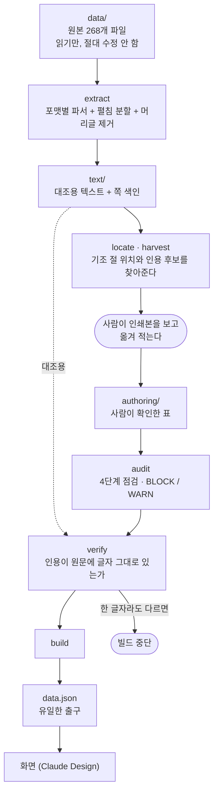

# 외교백서 「외교정책 기조」

대한민국 외교백서 1998~2025년 28개년에서 **「외교정책 기조」 절 한 곳만** 뽑아,
정권 교체가 한국 외교의 우선순위 서술을 무엇을 바꾸고 무엇을 바꾸지 못하는지
독자가 스스로 읽어내게 하는 자료와 화면.

정부는 해마다 그 해 외교의 우선순위를 **번호를 붙여 인쇄한다.**
이 프로젝트가 보여주는 숫자는 오직 그 번호다. 우리가 계산한 지표가 아니라
외교부가 매긴 순서다. **그 번호가 이 프로젝트의 유일한 척추다.**

---

## 무엇이 보이는가

한반도·북핵 줄기에 인쇄된 번호 (26개년 원문 대조 완료)

```
1998  2      2005  1      2012  1      2019  1
1999  1      2006  1      2013  1      2020  2
2000  1      2007  —      2014  1      2022  1
2001  1      2008  1      2015  2      2023  1
2002  1      2009  1      2017  2      2024  1
2003  1      2010  1      2018  1      2025  4
2004  1      2011  1
```

대부분 1번이지만 **다섯 번 밀렸고, 밀린 이유가 서로 다르다.**

| 연도 | 1번을 차지한 것 | 사정 |
|---|---|---|
| 1998 | 경제위기 극복 및 재도약 기틀 마련 | 외환위기 직후 |
| 2015 | 전략적 로드맵에 따른 주변국 외교 | — |
| 2017 | 주변 4국과 정상외교 공백 복원 | 탄핵으로 생긴 정상외교 공백 |
| 2020 | 우리 국민의 생명과 안전 보호 | 코로나19 |
| **2025** | 국익 중심 실용외교 기반 구축 | **외부 충격 없이, 그것도 4번까지** |

1998·2020년은 외부 충격이 밀어냈고 2017년은 정권 공백이 밀어냈다.
2025년만 그런 사정 없이 내려갔다.

**이 차이를 우리가 말로 설명하지 않는다.** 배치로 보여주고 판단은 독자가 한다.

### 표기 방식도 일곱 번 바뀐다

| 표기 | 연도 |
|---|---|
| 문장 속 나열 (`inline-lead`) | 1998, 1999 |
| 산문 (`prose`) | 2000, 2002 |
| 첫째·둘째 (`ordinal-word`) | 2001, 2003, 2004 |
| 번호 없는 소제목 (`heading`) | 2005 |
| 정책목표 Ⅰ~Ⅴ (`roman`) | 2006 |
| ①~⑤ (`circled`) | 2007 |
| ▲ 글머리 기호 (`bullet`) | 2013~2015, 2017 |
| 1. 2. 3. (`number`) | 2008~2012, 2018~2020, 2022~2025 |

**이 표 자체가 자료다.** "정부가 자기 우선순위에 이름 붙이는 방식"의 연대기이기
때문이다. `authoring/editions.tsv` 의 `markStyle` 에 기록해 두었다.

---

## 어떻게 만드는가



### 핵심 — 추출 손상이 화면에 닿지 않는다

```
PDF ──추출──▶ text/          (㤚鵬, 공백 소실, OCR 오탈자 — 손상 있음)
                  │
                  └──▶ verify 가 대조용으로만 쓴다
                                  ▲
사람이 인쇄본 보고 타이핑 ──▶ authoring ──▶ data.json ──▶ 화면
                             (李鵬, 정상)
```

화면에 나가는 인용문은 **사람이 원본을 보고 친 것**이고, 추출 텍스트는
**그것이 맞는지 검사하는 용도**로만 쓴다. 그래서 PDF 가 `李` 를 `㤚` 로,
가운뎃점을 `₩` 로 뽑아도 독자가 보는 글자는 멀쩡하다.

대신 대조가 헛돌기 때문에 `config/text_repairs.tsv` 에 **근거와 함께** 교정을
적어 둔다. 근거 없는 치환은 넣지 않는다.

### 검증이 심장이다

`verify.py` 는 모든 `title` 과 `quote` 가 그 해 원문에 **글자 그대로** 있는지
확인하고, 하나라도 어긋나면 **빌드를 멈춘다.** 부분 성공으로 넘어가지 않는다 —
절반만 맞는 자료는 틀린 자료다.

이것이 실제로 사고를 막았다. 세로쓰기 머리글을 지우려고 블록 필터를 넣었더니
본문이 10~30% 깎였는데, 2005년 인용 세 건이 실패로 떠서 되돌릴 수 있었다.

---

## 실행

```bash
python scripts/run.py
```

`extract → audit → verify → build` 순서를 강제한다. 감사에서 막히면 아래로 못 간다.

```bash
python scripts/run.py --from audit   # 표만 고쳤을 때
python scripts/run.py --strict       # WARN 도 실패로 친다 (배포 직전)
python scripts/audit.py              # 점검만
```

### 보조 도구

| 명령 | 하는 일 |
|---|---|
| `python scripts/locate.py` | 연도별 기조 절 후보를 찾아 리포트로 |
| `python scripts/show_items.py 2013` | 그 해 항목 목록을 표기 방식별로 훑어본다 |
| `python scripts/harvest.py 2010` | 소제목만 있는 항목의 본문 첫 문장을 후보로 |
| `python scripts/apply_quotes.py` | 고른 인용문을 `priorities.tsv` 에 일괄 반영 |
| `python scripts/fill_pages.py` | 인용문 위치로 인쇄 쪽수를 역산해 채움 |

### 필요한 것

- Python 3.12
- `pdfplumber` `PyMuPDF` `olefile`
- OCR 을 쓰려면 Tesseract 5 + `kor.traineddata`

---

## 포맷 여섯 세대

백서는 28년 동안 여섯 가지 포맷으로 나왔고, 세대마다 읽는 법이 다르다.

| 대상연도 | 형식 | 읽는 법 |
|---|---|---|
| 1998 | MS Word 97 | `word97.py` — FIB → 조각표(piece table) 추적 |
| 1999~2001 | HWP 5.0 (OLE) | `formats.py` — olefile + zlib raw inflate |
| 2002 | HWP 3.0 | `hwp3.py` — raw deflate + 조합형, **본문만 바이트 순서가 뒤집혀 있다** |
| 2003~2019 | 텍스트 PDF, 장별 분할 | PyMuPDF |
| 2017 · 2019 | 스캔 이미지 PDF | `ocr.py` — Tesseract 한국어 |
| 2020~2025 | 텍스트 PDF, 단일 파일 | PyMuPDF |

### 겪은 함정들

**연도 명명이 중간에 뒤집힌다**

| 제목 형태 | 대상 연도 |
|---|---|
| `YYYY 외교백서` | **YYYY − 1** |
| `YYYY년도 국제정세와 외교활동` | **YYYY** |

「2021 외교백서」(2020년)와 「2021년도 국제정세와 외교활동」(2021년)이 함께 있다.
**파일명 앞 네 자리로 정렬하면 전체가 한 해씩 어긋난다.** 폴더명을 기준으로 쓴다.

**좌우 펼침은 연도로 판단할 수 없다**

2004·2010·2015·2016·2018·2020~2025년이 펼침인데, **2015년은 1장만 단면이고
2~7장이 펼침**이다. 연도 규칙으로는 안 잡혀서 **쪽 폭(> 700pt)으로 판정**한다.

**폰트가 글리프를 엉뚱한 코드에 심어놓는다**

| 추출된 것 | 실제 | 연도 |
|---|---|---|
| `㤚` | `李` | 2003·2004 (`리펑(㤚鵬)`) |
| `₩` | `·` 중점 | 2008·2009 |
| `䞺` | `fi` 합자 | 2021 (`Paci䞺c`) |
| `쇼` | `▲` | 2017 (OCR) |
| `李` U+F9E1 | `李` U+674E | 호환용 한자. 눈으로 구별 불가 |

**공백이 통째로 사라지는 해가 있다** — 2003년 공백률 8.0%.
그래서 대조할 때는 공백을 전부 무시한다.

**쪽 머리글이 문장 한가운데를 파고든다** — 반복되는 줄을 세어 걷어내지만,
세로쓰기 머리글은 글자가 한 자씩 흩어져 걸러지지 않는다. 그 자리는 인용에서
`(…)` 로 끊는다. 생략 표시이자 "여기서 머리글이 끼어든다"는 기록이다.

---

## 데이터 계약

프런트엔드와의 유일한 접점은 `data.json` 하나다. 서버도 DB도 없다.
자세한 스키마와 화면 규율은 [`docs/claude-design-prompt.md`](docs/claude-design-prompt.md) 에 있다.

### 서술 규율 — UI 가 어떻게 생기든 지킨다

1. 모든 항목에서 **원문과 출처로 내려가는 경로**가 있어야 한다 (발간분·장·절·쪽)
2. **인용은 원문 그대로.** 요약·의역·윤문 금지
3. **우리 목소리로 인과를 주장하지 않는다**
   - ✗ "정권이 바뀌어서 순위가 바뀌었다"
   - ✓ "2025년 백서는 북핵을 4번에 두었다"
4. **집계 통계·자체 산출 순위를 만들지 않는다.** 화면의 숫자는 인쇄된 번호뿐
5. 교체가 없던 해도 **같은 형식으로** 볼 수 있어야 한다 (대조군)
6. 아직 채우지 않은 연도는 **비어 있음이 보여야** 한다
7. 정권을 **정당 색으로 칠하지 않는다**

### 세 가지 빈칸을 구별한다

| 상태 | 뜻 | 채워지는가 |
|---|---|---|
| `pending` | 아직 옮겨 적지 않음 | 채워진다 |
| `blocked` | **2016년.** 원본 PDF 에 인쇄 22~23쪽이 없다 | 자료를 구하면 채워진다 |
| `no-section` | **2021년.** 그 판에 기조 절 자체가 없다 | **영원히 채워지지 않는다** |

2021년 「2021년도 국제정세와 외교활동」은 편제가 바뀌어 기조 절을 싣지 않는다.
"자료 없음"으로 뭉뚱그리면 **정부가 그 해에 기조를 밝히지 않았다는 사실 자체를
지우게 된다.**

---

## 지금 상태

```
28개년 골격      1998~2025, 결손 없음
항목             141개 / 26개년
원문 대조        282건 전건 통과
data.json        115KB

status           verified 21 / partial 5 / blocked 1 / no-section 1
```

### 알려진 한계

측정으로 확인된 것만 적는다.

**1. 인용문이 제목뿐인 항목이 22개 있다**
본문에 소제목이 다시 나오지 않는 판(2006·2010·2023년 등)이라 기계로는 닿지 않는다.
화면에서 '원문 보기'를 눌러도 보여줄 것이 없어 **서술 규율 1을 아직 못 지킨다.**
원문을 직접 봐야 한다.

**2. 출처 쪽수가 없는 항목이 55개 있다**
1998~2002년은 `.doc`·HWP 라 파일에 쪽 개념이 없다. 인쇄본을 보고 적어야 한다.

**3. `links` 가 비어 있다**
항목 사이의 계승·개명·분화·소멸을 아직 판정하지 않았다.
예: 2013년 `북핵문제 진전을 위한 동력 강화` + `동북아 평화협력 구상` 이
2014년 `평화통일 신뢰외교` 로 합쳐진다 — 정권은 그대로인데 항목이 재편된 사례.

**4. `stream` 배정은 기계로 검증할 수 없다**
제목·인용은 원문 대조로 걸러지지만 "같은 줄기인가"는 확인할 방법이 없다.
그 판단이 곧 이 프로젝트의 주장이므로, 화면은 연결을 보여줄 때 **양쪽 원문을
함께** 제시해야 한다.

**5. OCR 유래 연도(2017·2019)는 오탈자가 섞여 있다**
`3018넌`, `평화제제` 같은 것이 남아 있어 그 문장은 인용으로 쓰지 않았다.
교정 공정을 따로 두어야 한다.

**6. 2005년 2번 항목이 비어 있다**
번호가 1·3·4 로 이어지지 않는다. 원문 확인 필요.

---

## 폴더

```
data/         원본 268개 파일. 읽기만 한다        (추적 안 함)
text/         대조용 텍스트 + 쪽 색인             (파생, 추적 안 함)
authoring/    사람이 확인한 표 — 저장소의 본체
  editions.tsv     발간분 28개년 · 표기 방식 · 상태
  priorities.tsv   항목 141개 · 제목 · 인용 · 인쇄된 번호
  streams.tsv      줄기 9개
  transitions.tsv  정권 이음매 7개
config/       text_repairs.tsv — 오추출 교정표
scripts/      파이프라인
reports/      감사·추출 리포트                    (파생, 추적 안 함)
docs/         설계 문서 · Claude Design 프롬프트
data.json     결과물
```

`text/` 와 `reports/` 는 원본에서 언제든 다시 만들 수 있어 추적하지 않는다.
**저장소에 남기는 것은 사람이 확인한 표와 그 결과다.**

---

## 왜 파이프라인에 LLM 을 넣지 않는가

1. **141개는 사람이 감당하는 양이다.** LLM 은 사람이 못 하는 규모일 때 값을 한다.
2. **연결 판정은 검증할 수 없다.** 제목·인용은 원문 대조로 기계 검증되지만
   "같은 줄기인가"는 기계가 확인할 방법이 없다.
3. **그 판단이 곧 이 프로젝트의 주장이다.** 어차피 검수할 것이면 처음부터 직접 한다.
4. **재현된다.** 규칙 + 표는 몇 년 뒤 돌려도 같은 결과가 나온다.

초안을 모델이 만드는 것은 무방하다. 저장소에 남는 것은 **사람이 확인한 표**이고
빌드 과정에는 모델이 없다.

---

## 출처

외교부 발간 「외교백서」 및 「국제정세와 외교활동」 1998~2025년.
원본 PDF·HWP·DOC 는 저장소에 포함하지 않는다.
